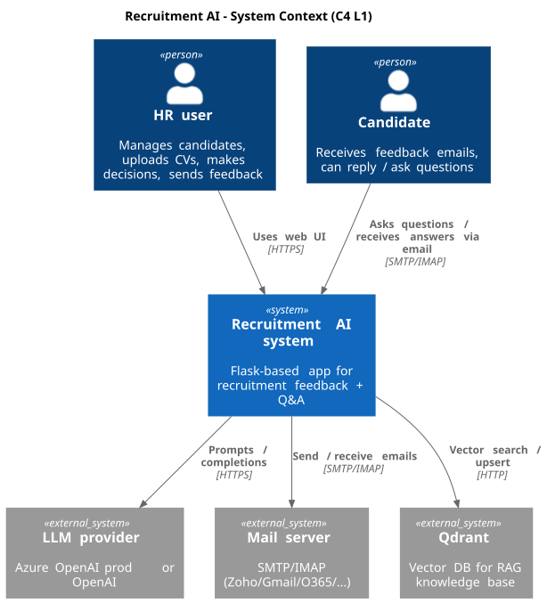
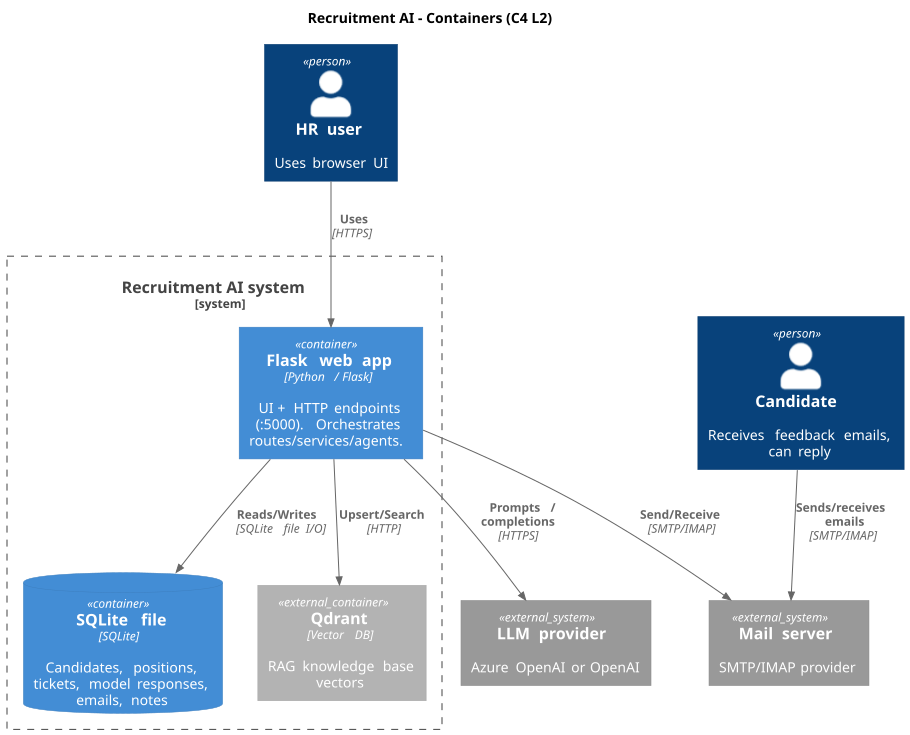
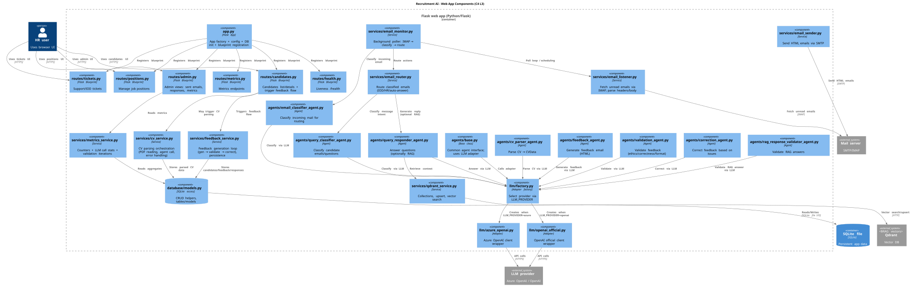
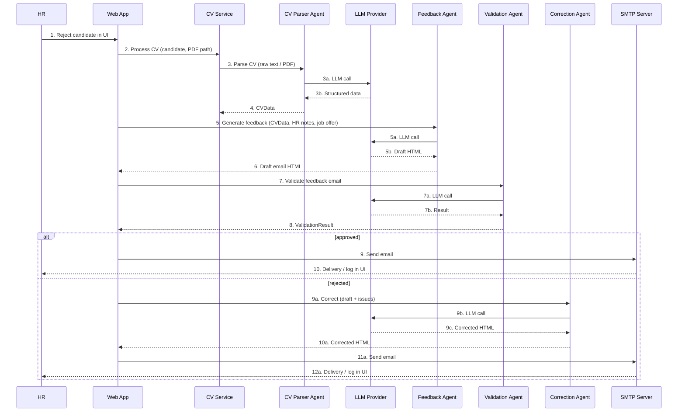
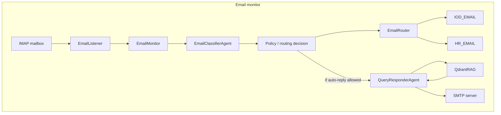

# System architecture – Recruitment AI

This document gives a high-level view of how the Recruitment AI system is built.
It follows a **lightweight C4-style structure**:

- **System Context (C4 L1)** – who uses the system and what external systems it talks to.
- **Containers (C4 L2)** – main deployable pieces (web app, databases, external services).
- **Components (C4 L3)** – key modules inside the web app (routes, agents, services).
- **Dynamic views** – key flows (feedback generation, incoming email handling).

C4 diagrams (L1–L3) are produced in **PlantUML (C4-PlantUML)** and embedded below as images.
Dynamic flow diagrams are expressed in **Mermaid** for readability in Markdown.

---

## 1. System Context (C4 L1)

At the highest level, the system consists of:

- **HR user (person)** – uses the web UI to manage candidates, upload CVs, make recruitment decisions, and send feedback emails.
- **Candidate (person)** – receives feedback emails and can reply or send questions.
- **Recruitment AI system (this system)** – Flask-based app that:
  - stores candidates, positions, tickets and model responses in SQLite,
  - talks to LLM providers (Azure OpenAI or OpenAI) via the LLM adapter,
  - sends and (optionally) monitors email via SMTP/IMAP,
  - uses Qdrant for RAG (retrieval-augmented generation) when answering questions.
- **External systems:**
  - **LLM provider** – Azure OpenAI (default) or OpenAI used for parsing CVs, generating feedback, validating/correcting emails, and answering questions (with or without RAG).
  - **SMTP/IMAP mail server** – Zoho, Gmail, Office 365, or any provider supporting SMTP/IMAP.
  - **Qdrant** – vector database used as the RAG knowledge base.

### Diagram (PlantUML → image)

---

## 2. Containers (C4 L2)

From the container point of view, the system typically consists of:

- **Web app container** – Flask application (Python) running as:
  - local `python app.py` process in development, or
  - Docker container (see `Dockerfile`, `docker-compose.yml`).
  It exposes HTTP endpoints on port 5000.

- **SQLite database (file)** – single-file database on disk:
  - stores candidates, positions, tickets, model responses, emails and notes,
  - lives under `data/` or project root, depending on configuration / Docker volume.

- **Qdrant** – vector store used for RAG:
  - can run as a Docker container (`qdrant` service in `docker-compose.yml`) or as an embedded/local instance (via local file path),
  - stores embedded documents from `knowledge_base/`.

- **LLM provider** – not hosted by this project:
  - **Azure OpenAI** (default) – accessed with Azure endpoint + deployment names,
  - **OpenAI** (optional) – accessed via `api.openai.com` using the official client,
  - selected by `LLM_PROVIDER` (`azure` / `openai`) and wired through `llm/` adapter.

- **Mail server (SMTP/IMAP)** – external provider:
  - configuration through `SMTP_HOST`, `SMTP_PORT`, `SMTP_USE_TLS`, `IMAP_HOST`, `IMAP_PORT`, `EMAIL_USERNAME`, `EMAIL_PASSWORD`,
  - the app does not care which provider is used as long as it speaks SMTP/IMAP.

### Diagram (PlantUML → image)

---

## 3. Components (C4 L3 – layers inside the web app)

This section describes the main **architectural layers** inside the Flask web application (not a file-by-file list; see **Appendix: Code map** for that).

### 3.1 Layer overview

| Layer | Responsibility |
|-------|----------------|
| **HTTP API + UI** | Flask routes and templates; exposes candidate/position/ticket CRUD, process (reject/accept), admin, health. |
| **Workflow Orchestrator** | Runs the feedback loop (CV → parse → draft → validate → correct → send) and the inbound-email loop (fetch → classify → route / reply). |
| **LLM Gateway / Adapter** | Single entry point to Azure OpenAI or OpenAI; retries, timeouts, logging; prompt templates live in `prompts/`. Agents call through this layer only. |
| **Agent Runtime** | CV Parser, Feedback, Validation, Correction, Email Classifier, Query Responder (and RAG response validator). Each agent has a clear input/output contract (see below). |
| **Email Adapter** | SMTP sender (outbound) and IMAP listener (inbound); provider-agnostic, config-driven. |
| **Persistence** | SQLite for candidates, positions, tickets, model responses, HR notes, feedback emails; file system for uploaded CVs and config. |
| **RAG Store** | Qdrant: vector ingestion from `knowledge_base/`, similarity search; used by Query Responder and (optionally) feedback context. |

### 3.2 Agent contracts (inputs / outputs)

| Agent | Input | Output |
|-------|--------|--------|
| **CV Parser Agent** | Raw CV (text or PDF path) | `CVData` (structured) |
| **Feedback Agent** | `CVData`, HR notes, position/job offer | Draft email HTML |
| **Validation Agent** | Draft email HTML | `ValidationResult` (approved / issues) |
| **Correction Agent** | Draft email HTML + validation issues | Corrected email HTML |
| **Email Classifier Agent** | Inbound email (headers + body) | Label + routing directive (IOD / HR / consent_yes|no / default) |
| **Query Responder Agent** | Inbound question + optional RAG context | Answer text (optionally validated by RAG response validator) |

All agents use the **LLM Gateway**; no direct OpenAI/Azure client calls in agent code.

### 3.3 Diagram (PlantUML → image)

### Appendix: Code map

- **HTTP API + UI:** `app.py`, `routes/candidates.py`, `routes/positions.py`, `routes/tickets.py`, `routes/admin.py`, `routes/health.py`, `templates/`.
- **Workflow / orchestration:** `services/feedback_service.py`, `services/cv_service.py`; inbound loop in `services/email_monitor.py`, `services/email_router.py`, `services/email_listener.py`.
- **LLM Gateway:** `llm/base.py`, `llm/azure_openai.py`, `llm/openai_official.py`, `llm/factory.py`; prompts in `prompts/*.py`.
- **Agents:** `agents/cv_parser_agent.py`, `agents/feedback_agent.py`, `agents/validation_agent.py`, `agents/correction_agent.py`, `agents/email_classifier_agent.py`, `agents/query_classifier_agent.py`, `agents/query_responder_agent.py`, `agents/rag_response_validator_agent.py`.
- **Email adapter:** `services/email_sender.py`, `services/email_listener.py`.
- **Persistence:** `database/models.py`, `database/*.py`; SQLite file under `data/` or project root; `uploads/` for CVs.
- **RAG Store:** `services/qdrant_service.py`, `knowledge_base/load_to_qdrant.py`.

---

## 4. Key constraints and safety

- **Human-in-the-loop:** Outbound feedback email is sent only after an explicit HR action (e.g. “Reject” with “Send feedback”). Auto-reply to inbound emails is optional and can be gated by feature flag or policy.
- **Fail-closed:** If validation or policy checks fail, the system does not send the email; the flow stops or retries correction until approved or manually overridden.
- **PII boundaries:** CV text, HR notes and candidate data are sent to the LLM for feedback generation; the design assumes a trusted LLM provider and no masking in this MVP; for production, consider redaction or on-prem models.
- **Audit trail:** Model prompts and responses (or their hashes) and template versions can be stored (e.g. in `model_responses` and related tables) for traceability and HR compliance.

---

## 5. Technical decisions

### 5.1 Flask
- **Why:** Lightweight, easy to run locally and in Docker, minimal dependencies; fits MVP and educational use.
- **Trade-off:** No built-in async job queue, horizontal scaling, or auth; add them if moving toward production.

### 5.2 SQLite
- **Why:** Single-file DB, no separate server; sufficient for small/medium datasets and demos.
- **Trade-off:** Concurrency and scale limits; migrate to PostgreSQL (or similar) for multi-worker or high-load scenarios.

### 5.3 Qdrant and RAG
- **Why:** Simple vector store; documents from `knowledge_base/` are embedded and stored; on query: embed query → vector search → inject context into LLM prompt. Used for candidate questions (company, process, IOD/GDPR).
- **Trade-off:** Embedding model and collection design are fixed in this MVP; tune for latency and relevance in production.

### 5.4 State
- **Persistent:** SQLite (canonical), Qdrant (vectors), file system (uploads). **Transient:** in-process caches. No external session store; intentionally simple for the MVP.

---

## 6. External dependencies

- **LLM providers (Azure OpenAI / OpenAI)** via `llm/` adapter: CV parsing, feedback generation, validation/correction, incoming email classification and answering (with/without RAG).
- **SMTP / IMAP mail servers:** Any provider supporting SMTP/IMAP; fully config-driven.
- **Qdrant:** Vector DB for RAG; runs as embedded/local or Docker service.

---

## 7. Dynamic views (flows)

### 7.1 Recruitment / feedback flow (Mermaid)

CV Service calls **CV Parser Agent** for parsing; **Feedback Agent** only generates draft HTML from already-parsed CVData. The **LLM provider** is shown as a participant because all agent steps go through it.

### 7.2 Incoming email handling flow (Mermaid)

**Policy check** happens before auto-reply: the router decides IOD / HR / auto-reply only after classification; auto-reply is the path where policy allows answering without human review.

