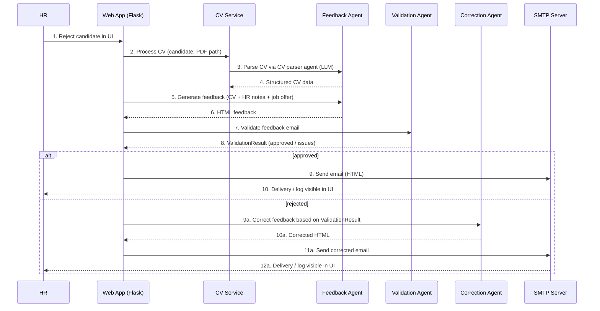
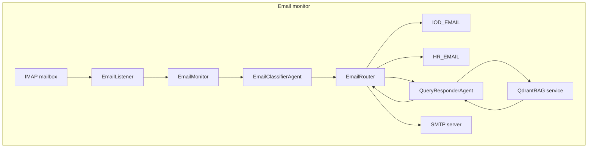

# System architecture – Recruitment AI

This document gives a high-level view of how the Recruitment AI system is built.
It follows a **lightweight C4-style structure**:

- **System Context (C4 L1)** – who uses the system and what external systems it talks to.
- **Containers (C4 L2)** – main deployable pieces (web app, databases, external services).
- **Components (C4 L3)** – key modules inside the web app (routes, agents, services).
- **Dynamic views** – key flows (feedback generation, incoming email handling).

C4 diagrams (L1–L3) are produced in **PlantUML (C4-PlantUML)** and embedded below as images.
Dynamic flow diagrams are expressed in **Mermaid** for readability in Markdown.

---

## 1. System Context (C4 L1)

At the highest level, the system consists of:

- **HR user (person)** – uses the web UI to manage candidates, upload CVs, make recruitment decisions, and send feedback emails.
- **Candidate (person)** – receives feedback emails and can reply or send questions.
- **Recruitment AI system (this system)** – Flask-based app that:
  - stores candidates, positions, tickets and model responses in SQLite,
  - talks to LLM providers (Azure OpenAI or OpenAI) via the LLM adapter,
  - sends and (optionally) monitors email via SMTP/IMAP,
  - uses Qdrant for RAG (retrieval-augmented generation) when answering questions.
- **External systems:**
  - **LLM provider** – Azure OpenAI (default) or OpenAI used for parsing CVs, generating feedback, validating/correcting emails, and answering questions (with or without RAG).
  - **SMTP/IMAP mail server** – Zoho, Gmail, Office 365, or any provider supporting SMTP/IMAP.
  - **Qdrant** – vector database used as the RAG knowledge base.

### Diagram (PlantUML → image)

---

## 2. Containers (C4 L2)

From the container point of view, the system typically consists of:

- **Web app container** – Flask application (Python) running as:
  - local `python app.py` process in development, or
  - Docker container (see `Dockerfile`, `docker-compose.yml`).
  It exposes HTTP endpoints on port 5000.

- **SQLite database (file)** – single-file database on disk:
  - stores candidates, positions, tickets, model responses, emails and notes,
  - lives under `data/` or project root, depending on configuration / Docker volume.

- **Qdrant** – vector store used for RAG:
  - can run as a Docker container (`qdrant` service in `docker-compose.yml`) or as an embedded/local instance (via local file path),
  - stores embedded documents from `knowledge_base/`.

- **LLM provider** – not hosted by this project:
  - **Azure OpenAI** (default) – accessed with Azure endpoint + deployment names,
  - **OpenAI** (optional) – accessed via `api.openai.com` using the official client,
  - selected by `LLM_PROVIDER` (`azure` / `openai`) and wired through `llm/` adapter.

- **Mail server (SMTP/IMAP)** – external provider:
  - configuration through `SMTP_HOST`, `SMTP_PORT`, `SMTP_USE_TLS`, `IMAP_HOST`, `IMAP_PORT`, `EMAIL_USERNAME`, `EMAIL_PASSWORD`,
  - the app does not care which provider is used as long as it speaks SMTP/IMAP.

### Diagram (PlantUML → image)

---

## 3. Components (C4 L3 – inside the Flask web app)

This section describes the main components **inside the Flask web application**.

### 3.1 Flask and routes

- **Flask app (`app.py`)**
  - Creates the Flask application, initializes configuration and database, seeds example data on first run, and registers route blueprints.
  - Exposes health and index routes, and orchestrates candidate operations (add, reject, process).

- **Routes (`routes/*.py`)** – main modules include:
  - `routes/candidates.py` – list, add, view candidate details, trigger feedback flow.
  - `routes/positions.py` – manage job positions.
  - `routes/tickets.py` – handle support / IOD tickets.
  - `routes/admin.py` – admin views: sent emails, model responses, metrics.
  - `routes/metrics.py` (or equivalent) – returns metrics/health information.
  - `routes/health.py` – `/health` endpoint for liveness checks.

### 3.2 Agents (`agents/`)

- **CV parser agent** – parses uploaded CV (text or PDF) into structured `CVData`.
- **Feedback agent** – generates HTML feedback email given CV + HR notes + job offer.
- **Validation agent** – checks feedback for correctness, ethics, formatting, returns `ValidationResult`.
- **Correction agent** – produces corrected HTML based on rejected feedback + validation issues.
- **Query classifier agent** – classifies free-form emails/questions (IOD vs general vs consent).
- **Query responder agent** – answers candidate questions using context (optionally with RAG).
- **Email classifier agent** – classifies incoming emails for routing (IOD, consent, general).
- **RAG response validator agent** – validates RAG-generated answers.

All agents inherit from `BaseAgent` and call the LLM via the **LLM adapter** (`llm/` package), not directly through OpenAI/Azure clients.

### 3.3 Services (`services/`)

- **CV service (`cv_service.py`)**
  - Orchestrates CV parsing: calls PDF reader, CV parser agent, handles errors (invalid PDF, OCR fallback).

- **Feedback service (`feedback_service.py`)**
  - Orchestrates the full feedback flow:
    - calls CV service (if needed),
    - calls Feedback agent,
    - optionally runs Validation + Correction loop,
    - records iterations and results in the database,
    - hands off email content to the email sender.

- **Email sender (`email_sender.py`)**
  - Sends HTML emails via SMTP.

- **Email listener/router/monitor (`email_listener.py`, `email_router.py`, `email_monitor.py`)**
  - **Listener** – connects to IMAP, fetches unread emails, parses headers/body.
  - **Router** – routes classified email:
    - forward to IOD,
    - forward to HR,
    - answer automatically via Query responder + RAG,
    - update candidate records or tickets.
  - **Monitor** – background thread periodically polling IMAP, passing emails through classifier + router.

- **Qdrant service (`qdrant_service.py`)**
  - Wraps access to Qdrant: create collections, upsert docs, vector search.

- **Metrics service (`metrics_service.py`)**
  - Aggregates metrics such as validation iterations and LLM calls per agent.

### 3.4 Data stores

- **SQLite database (`database/`)**
  - Tables for candidates, positions, tickets, model responses, HR notes, feedback emails, validation errors.
  - Accessed via `database/models.py` (CRUD helpers) and used by services/routes.

- **Qdrant (`knowledge_base/load_to_qdrant.py`)**
  - Loads `.txt` documents from `knowledge_base/` into Qdrant as vectors.

- **File system**
  - `uploads/` – uploaded CV PDFs.
  - `data/` – SQLite DB and runtime data (depending on config/Docker volumes).

### Diagram (PlantUML → image)

---

## 4. Technical decisions

### 4.1 Flask
- Lightweight framework:
  - easy to run locally and in Docker,
  - minimal dependencies, good for MVP / educational project.

### 4.2 SQLite
- Single-file database:
  - no separate DB server required,
  - sufficient for small/medium datasets and demos.

### 4.3 Qdrant and RAG
- Qdrant used as a vector store:
  - documents from `knowledge_base/` are embedded (via embeddings) and stored as vectors,
  - on query:
    1. embed the query,
    2. vector search in Qdrant,
    3. inject retrieved text into the LLM prompt.

Used mainly for candidate questions about the company, process, policies, and IOD/GDPR-related questions.

### 4.4 State
- **Persistent state:** SQLite (canonical), Qdrant (vectors), file system (uploads).
- **Transient state:** in-process caches, temporary Python objects.

No external session store; intentionally simple for the MVP / book use case.

---

## 5. External dependencies

- **LLM providers (Azure OpenAI / OpenAI)** via `llm/` adapter:
  - CV parsing, feedback generation, validation/correction,
  - incoming email classification and answering (with/without RAG).

- **SMTP / IMAP mail servers**
  - Any provider that supports SMTP/IMAP.
  - Fully config-driven.

- **Qdrant**
  - Vector DB for RAG.
  - Runs as embedded/local or Docker service.

---

## 6. Dynamic views (flows)

### 6.1 Recruitment / feedback flow (Mermaid)

### 6.2 Incoming email handling flow (Mermaid)

