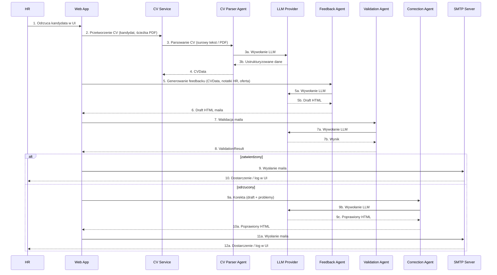
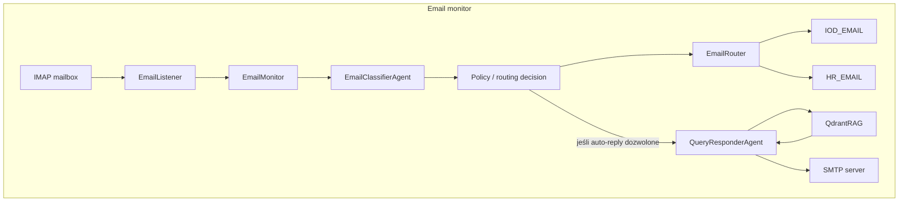

# Architektura systemu – Recruitment AI

Ten dokument opisuje w skrócie, jak zbudowany jest system **Recruitment AI**.
Trzyma się lekkiej wersji podejścia **C4**:

- **Kontekst systemu (C4 L1)** – kto korzysta z systemu i jakie systemy zewnętrzne są w grze.
- **Kontenery (C4 L2)** – główne “pudełka” wdrożeniowe (aplikacja webowa, bazy, usługi zewnętrzne).
- **Komponenty (C4 L3)** – ważniejsze moduły wewnątrz aplikacji (routes, agents, services).
- **Widoki dynamiczne** – kluczowe przepływy (generowanie feedbacku, obsługa przychodzących maili).

Rysunki C4 (L1–L3) są przygotowane jako **PlantUML (C4-PlantUML)** i osadzone jako obrazki.
Przepływy dynamiczne są pokazane jako diagramy **Mermaid**.

---

## 1. Kontekst systemu (C4 L1)

Na najwyższym poziomie w systemie biorą udział:

- **Użytkownik HR (osoba)** – korzysta z UI do zarządzania kandydatami, uploadu CV,
  podejmowania decyzji i wysyłania maili z feedbackiem.
- **Kandydat (osoba)** – dostaje maile z informacją zwrotną, może na nie odpowiedzieć
  lub zadać pytania.
- **System Recruitment AI (ten system)** – aplikacja Flask, która:
  - przechowuje kandydatów, stanowiska, tickety i odpowiedzi modeli w SQLite,
  - komunikuje się z dostawcą LLM (Azure OpenAI lub OpenAI) przez warstwę adaptera,
  - wysyła i (opcjonalnie) monitoruje pocztę przez SMTP/IMAP,
  - używa Qdrant jako bazy wektorowej do RAG przy odpowiadaniu na pytania.
- **Systemy zewnętrzne:**
  - **Dostawca LLM** – Azure OpenAI (domyślnie) lub OpenAI; używany do parsowania CV,
    generowania feedbacku, walidacji/korekty maili oraz do odpowiedzi na pytania.
  - **Serwer SMTP/IMAP** – np. Zoho, Gmail, Office 365 lub inny kompatybilny z SMTP/IMAP.
  - **Qdrant** – baza wektorowa używana jako knowledge base dla RAG.

### Diagram (PlantUML → obraz)

---

## 2. Kontenery (C4 L2)

Z perspektywy kontenerów system składa się z:

- **Kontener aplikacji webowej** – aplikacja Flask (Python) uruchamiana jako:
  - lokalny proces `python app.py` w dev,
  - kontener Dockera (zob. `Dockerfile`, `docker-compose.yml`).
  Nasłuchuje HTTP na porcie 5000.

- **Baza SQLite (plik)** – pojedynczy plik bazy na dysku:
  - przechowuje kandydatów, stanowiska, tickety, odpowiedzi modeli, maile i notatki,
  - znajduje się w katalogu `data/` lub w katalogu projektu (zależnie od konfiguracji / wolumenu Dockera).

- **Qdrant** – wektorowy store do RAG:
  - może działać jako kontener Dockera (`qdrant` w `docker-compose.yml`) lub instancja lokalna,
  - przechowuje zembeddowane dokumenty z `knowledge_base/`.

- **Dostawca LLM** – nie jest hostowany przez ten projekt:
  - **Azure OpenAI** (domyślnie) – używa endpointu Azure + nazw deploymentów,
  - **OpenAI** (opcjonalnie) – przez `api.openai.com` i oficjalnego klienta,
  - wybór przez `LLM_PROVIDER` (`azure` / `openai`) i adapter w `llm/`.

- **Serwer mailowy (SMTP/IMAP)** – dostawca zewnętrzny:
  - konfiguracja przez `SMTP_HOST`, `SMTP_PORT`, `SMTP_USE_TLS`, `IMAP_HOST`,
    `IMAP_PORT`, `EMAIL_USERNAME`, `EMAIL_PASSWORD`,
  - aplikacja nie zakłada konkretnego dostawcy – ważne, by mówił SMTP/IMAP.

### Diagram (PlantUML → obraz)

---

## 3. Komponenty (C4 L3 – warstwy wewnątrz aplikacji)

Ta sekcja opisuje **warstwy architektoniczne** wewnątrz aplikacji Flask (nie listę plików; mapę kodu znajdziesz w **Załączniku: Code map**).

### 3.1 Przegląd warstw

| Warstwa | Odpowiedzialność |
|---------|------------------|
| **HTTP API + UI** | Routes i szablony Flask; CRUD kandydatów/stanowisk/ticketów, proces (odrzucenie/akceptacja), admin, health. |
| **Workflow Orchestrator** | Prowadzi pętlę feedbacku (CV → parse → draft → validate → correct → send) oraz pętlę maili przychodzących (pobierz → klasyfikuj → routuj / odpowiedz). |
| **LLM Gateway / Adapter** | Jedno wejście do Azure OpenAI lub OpenAI; retry, timeouty, logowanie; szablony promptów w `prompts/`. Agenci korzystają tylko z tej warstwy. |
| **Agent Runtime** | CV Parser, Feedback, Validation, Correction, Email Classifier, Query Responder (oraz RAG response validator). Każdy agent ma jasny kontrakt wejście/wyjście (tabela poniżej). |
| **Email Adapter** | Wysyłka SMTP (outbound) i odbiór IMAP (inbound); niezależny od dostawcy, sterowany konfiguracją. |
| **Persistence** | SQLite: kandydaci, stanowiska, tickety, odpowiedzi modeli, notatki HR, maile; system plików na uploady CV i konfig. |
| **RAG Store** | Qdrant: ingest z `knowledge_base/`, wyszukiwanie podobieństwa; używany przez Query Responder i opcjonalnie kontekst feedbacku. |

### 3.2 Kontrakty agentów (wejścia / wyjścia)

| Agent | Wejście | Wyjście |
|-------|---------|---------|
| **CV Parser Agent** | Surowe CV (tekst lub ścieżka PDF) | `CVData` (ustrukturyzowane) |
| **Feedback Agent** | `CVData`, notatki HR, stanowisko/oferta | Draft HTML maila |
| **Validation Agent** | Draft HTML maila | `ValidationResult` (zatwierdzony / lista problemów) |
| **Correction Agent** | Draft HTML + problemy z walidacji | Poprawiony HTML maila |
| **Email Classifier Agent** | Mail przychodzący (nagłówki + treść) | Etykieta + dyrektywa routingu (IOD / HR / consent_yes|no / default) |
| **Query Responder Agent** | Pytanie + opcjonalny kontekst RAG | Odpowiedź (opcjonalnie walidowana przez RAG response validator) |

Wszyscy agenci korzystają z **LLM Gateway**; w kodzie agentów nie ma bezpośrednich wywołań klienta OpenAI/Azure.

### 3.3 Diagram (PlantUML → obraz)

### Załącznik: Code map

- **HTTP API + UI:** `app.py`, `routes/candidates.py`, `routes/positions.py`, `routes/tickets.py`, `routes/admin.py`, `routes/health.py`, `templates/`.
- **Workflow / orkiestracja:** `services/feedback_service.py`, `services/cv_service.py`; pętla inbound w `services/email_monitor.py`, `services/email_router.py`, `services/email_listener.py`.
- **LLM Gateway:** `llm/base.py`, `llm/azure_openai.py`, `llm/openai_official.py`, `llm/factory.py`; prompty w `prompts/*.py`.
- **Agenci:** `agents/cv_parser_agent.py`, `agents/feedback_agent.py`, `agents/validation_agent.py`, `agents/correction_agent.py`, `agents/email_classifier_agent.py`, `agents/query_classifier_agent.py`, `agents/query_responder_agent.py`, `agents/rag_response_validator_agent.py`.
- **Email adapter:** `services/email_sender.py`, `services/email_listener.py`.
- **Persistence:** `database/models.py`, `database/*.py`; plik SQLite w `data/` lub w katalogu projektu; `uploads/` na CV.
- **RAG Store:** `services/qdrant_service.py`, `knowledge_base/load_to_qdrant.py`.

---

## 4. Kluczowe ograniczenia i bezpieczeństwo

- **Human-in-the-loop:** Mail z feedbackiem jest wysyłany tylko po jawnej akcji HR (np. „Odrzuć” z „Wyślij feedback”). Auto-odpowiedź na maile przychodzące jest opcjonalna i może być ograniczona flagą lub polityką.
- **Fail-closed:** Gdy walidacja lub polityka nie przejdzie, system nie wysyła maila; flow się zatrzymuje lub powtarza korektę do zatwierdzenia / ręcznej nadpisania.
- **Granice PII:** Tekst CV, notatki HR i dane kandydata trafiają do LLM przy generowaniu feedbacku; w tym MVP zakładamy zaufanego dostawcę LLM bez maskowania; w produkcji rozważyć redakcję lub modele on-prem.
- **Audit trail:** Prompty i odpowiedzi modelu (lub ich hashe) oraz wersje szablonów można zapisywać (np. w `model_responses` i powiązanych tabelach) w celu śledzenia i zgodności HR.

---

## 5. Decyzje techniczne

### 5.1 Flask
- **Dlaczego:** Lekki framework, łatwy do uruchomienia lokalnie i w Dockerze, mało zależności; pasuje do MVP i celów edukacyjnych.
- **Trade-off:** Brak wbudowanej kolejki zadań async, skalowania horyzontalnego i auth; dodać przy zbliżaniu się do produkcji.

### 5.2 SQLite
- **Dlaczego:** Baza w jednym pliku, bez osobnego serwera; wystarczająca dla małych/średnich zbiorów i demo.
- **Trade-off:** Ograniczenia współbieżności i skali; migracja do PostgreSQL (lub innego) przy wielu workerach lub większym obciążeniu.

### 5.3 Qdrant i RAG
- **Dlaczego:** Prosty store wektorowy; dokumenty z `knowledge_base/` są embedowane i zapisywane; przy zapytaniu: embed → wyszukiwanie wektorowe → wstrzyknięcie kontekstu do promptu LLM. Używane do pytań kandydatów (firma, proces, IOD/RODO).
- **Trade-off:** Model embeddingów i projekt kolekcji są ustalone w tym MVP; w produkcji dostroić pod latency i trafność.

### 5.4 Stan
- **Trwały:** SQLite (źródło prawdy), Qdrant (wektory), system plików (uploady). **Chwilowy:** cache w procesie. Brak zewnętrznego session store – celowo prosto dla MVP.

---

## 6. Zależności zewnętrzne

- **Dostawcy LLM (Azure OpenAI / OpenAI)** przez adapter `llm/`: parsowanie CV, generowanie feedbacku, walidacja/korekta, klasyfikacja i odpowiedzi na maile (z RAG lub bez).
- **Serwery SMTP / IMAP:** Dowolny dostawca zgodny z SMTP/IMAP; w pełni sterowane konfiguracją.
- **Qdrant:** Baza wektorowa do RAG; lokalnie lub w Dockerze.

---

## 7. Widoki dynamiczne (przepływy)

CV Service wywołuje **CV Parser Agent** do parsowania; **Feedback Agent** tylko generuje draft HTML z już sparsowanego CVData. **Dostawca LLM** jest widoczny jako participant.

### 7.1 Przepływ “Rekrutacja / feedback” (Mermaid)

### 7.2 Przepływ “Obsługa maila przychodzącego” (Mermaid)
**Policy check** odbywa się przed auto-odpowiedzią: router decyduje IOD / HR / auto-reply dopiero po klasyfikacji; auto-reply to ścieżka, w której polityka zezwala na odpowiedź bez przeglądu przez człowieka.

