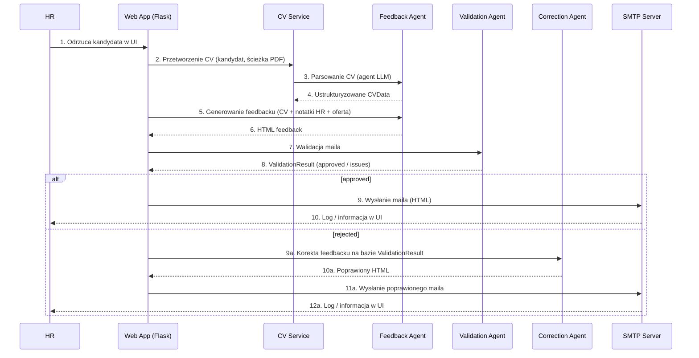
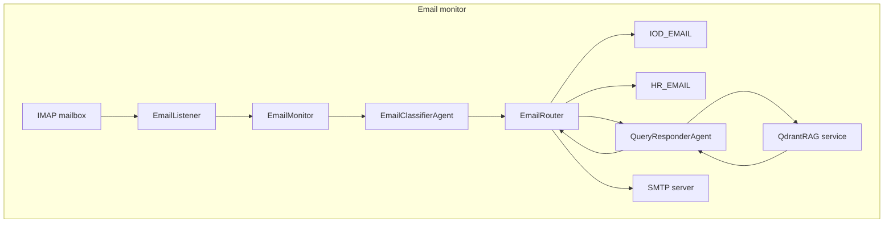

# Architektura systemu – Recruitment AI

Ten dokument opisuje w skrócie, jak zbudowany jest system **Recruitment AI**.
Trzyma się lekkiej wersji podejścia **C4**:

- **Kontekst systemu (C4 L1)** – kto korzysta z systemu i jakie systemy zewnętrzne są w grze.
- **Kontenery (C4 L2)** – główne “pudełka” wdrożeniowe (aplikacja webowa, bazy, usługi zewnętrzne).
- **Komponenty (C4 L3)** – ważniejsze moduły wewnątrz aplikacji (routes, agents, services).
- **Widoki dynamiczne** – kluczowe przepływy (generowanie feedbacku, obsługa przychodzących maili).

Rysunki C4 (L1–L3) są przygotowane jako **PlantUML (C4-PlantUML)** i osadzone jako obrazki.
Przepływy dynamiczne są pokazane jako diagramy **Mermaid**.

---

## 1. Kontekst systemu (C4 L1)

Na najwyższym poziomie w systemie biorą udział:

- **Użytkownik HR (osoba)** – korzysta z UI do zarządzania kandydatami, uploadu CV,
  podejmowania decyzji i wysyłania maili z feedbackiem.
- **Kandydat (osoba)** – dostaje maile z informacją zwrotną, może na nie odpowiedzieć
  lub zadać pytania.
- **System Recruitment AI (ten system)** – aplikacja Flask, która:
  - przechowuje kandydatów, stanowiska, tickety i odpowiedzi modeli w SQLite,
  - komunikuje się z dostawcą LLM (Azure OpenAI lub OpenAI) przez warstwę adaptera,
  - wysyła i (opcjonalnie) monitoruje pocztę przez SMTP/IMAP,
  - używa Qdrant jako bazy wektorowej do RAG przy odpowiadaniu na pytania.
- **Systemy zewnętrzne:**
  - **Dostawca LLM** – Azure OpenAI (domyślnie) lub OpenAI; używany do parsowania CV,
    generowania feedbacku, walidacji/korekty maili oraz do odpowiedzi na pytania.
  - **Serwer SMTP/IMAP** – np. Zoho, Gmail, Office 365 lub inny kompatybilny z SMTP/IMAP.
  - **Qdrant** – baza wektorowa używana jako knowledge base dla RAG.

### Diagram (PlantUML → obraz)

---

## 2. Kontenery (C4 L2)

Z perspektywy kontenerów system składa się z:

- **Kontener aplikacji webowej** – aplikacja Flask (Python) uruchamiana jako:
  - lokalny proces `python app.py` w dev,
  - kontener Dockera (zob. `Dockerfile`, `docker-compose.yml`).
  Nasłuchuje HTTP na porcie 5000.

- **Baza SQLite (plik)** – pojedynczy plik bazy na dysku:
  - przechowuje kandydatów, stanowiska, tickety, odpowiedzi modeli, maile i notatki,
  - znajduje się w katalogu `data/` lub w katalogu projektu (zależnie od konfiguracji / wolumenu Dockera).

- **Qdrant** – wektorowy store do RAG:
  - może działać jako kontener Dockera (`qdrant` w `docker-compose.yml`) lub instancja lokalna,
  - przechowuje zembeddowane dokumenty z `knowledge_base/`.

- **Dostawca LLM** – nie jest hostowany przez ten projekt:
  - **Azure OpenAI** (domyślnie) – używa endpointu Azure + nazw deploymentów,
  - **OpenAI** (opcjonalnie) – przez `api.openai.com` i oficjalnego klienta,
  - wybór przez `LLM_PROVIDER` (`azure` / `openai`) i adapter w `llm/`.

- **Serwer mailowy (SMTP/IMAP)** – dostawca zewnętrzny:
  - konfiguracja przez `SMTP_HOST`, `SMTP_PORT`, `SMTP_USE_TLS`, `IMAP_HOST`,
    `IMAP_PORT`, `EMAIL_USERNAME`, `EMAIL_PASSWORD`,
  - aplikacja nie zakłada konkretnego dostawcy – ważne, by mówił SMTP/IMAP.

### Diagram (PlantUML → obraz)

---

## 3. Komponenty (C4 L3 – wewnątrz aplikacji Flask)

Ta część opisuje główne komponenty **wewnątrz** aplikacji Flask.

### 3.1 Flask i routes

- **Aplikacja Flask (`app.py`)**
  - Tworzy obiekt aplikacji, ładuje konfigurację i bazę, przy pierwszym uruchomieniu
    zasiewa przykładowe dane, rejestruje blueprinty.
  - Wystawia endpointy health/index i orkiestruje operacje na kandydatach
    (dodanie, odrzucenie, procesowanie).

- **Routes (`routes/*.py`)** – główne moduły:
  - `routes/candidates.py` – lista/dodawanie/podgląd kandydatów, wywołanie flow feedbacku.
  - `routes/positions.py` – zarządzanie stanowiskami.
  - `routes/tickets.py` – tickety (np. IOD).
  - `routes/admin.py` – widoki admina: wysłane maile, odpowiedzi modeli, metryki.
  - `routes/metrics.py` (lub podobny) – zwraca metryki/health.
  - `routes/health.py` – `/health` (liveness).

### 3.2 Agenci (`agents/`)

- **CV parser agent** – parsuje CV do `CVData`.
- **Feedback agent** – generuje HTML‑owy feedback na podstawie CV + notatek HR + oferty.
- **Validation agent** – sprawdza poprawność / etykę / format feedbacku, zwraca `ValidationResult`.
- **Correction agent** – poprawia feedback bazując na `ValidationResult`.
- **Query classifier agent** – klasyfikuje maile/pytania (IOD vs ogólne vs zgoda).
- **Query responder agent** – odpowiada na pytania, opcjonalnie z użyciem RAG.
- **Email classifier agent** – klasyfikuje maile przychodzące do routingu.
- **RAG response validator agent** – waliduje odpowiedzi wygenerowane z RAG.

Wszyscy agenci dziedziczą po `BaseAgent` i wołają LLM przez adapter `llm/`, nigdy
bezpośrednio przez klienta OpenAI/Azure.

### 3.3 Serwisy (`services/`)

- **CV service (`cv_service.py`)**
  - Orkiestruje parsowanie CV: PDF reader, CV parser agent, obsługa błędów (np. zły PDF).

- **Feedback service (`feedback_service.py`)**
  - Prowadzi cały flow feedbacku:
    - woła CV service (jeśli trzeba),
    - woła Feedback agent,
    - opcjonalnie pętla Validation + Correction,
    - zapisuje iteracje i wynik do DB,
    - przekazuje treść maila do modułu wysyłki.

- **Email sender (`email_sender.py`)**
  - Wysyła maile HTML przez SMTP.

- **Email listener/router/monitor (`email_listener.py`, `email_router.py`, `email_monitor.py`)**
  - **Listener** – łączy się do IMAP, pobiera nieprzeczytane maile, parsuje.
  - **Router** – decyduje co zrobić z mailami:
    - przekazać do IOD,
    - przekazać do HR,
    - odpowiedzieć automatycznie (Query responder + RAG),
    - zaktualizować rekord kandydata / ticket.
  - **Monitor** – wątek w tle, który cyklicznie pyta IMAP i odpala listener + router.

- **Qdrant service (`qdrant_service.py`)**
  - Odpowiada za tworzenie kolekcji, upsert dokumentów, wyszukiwanie wektorowe.

- **Metrics service (`metrics_service.py`)**
  - Liczy metryki (np. ile iteracji walidacji, ile wywołań LLM na agenta).

### 3.4 Dane

- **SQLite (`database/`)**
  - Tabele: kandydaci, stanowiska, tickety, odpowiedzi modeli, notatki HR, maile,
    błędy walidacji.

- **Qdrant (`knowledge_base/load_to_qdrant.py`)**
  - Ładuje pliki `.txt` do Qdrant jako wektory.

- **System plików**
  - `uploads/` – wrzucone CV PDF.
  - `data/` – plik bazy i inne dane runtime.

### Diagram (PlantUML → obraz)

---

## 4. Decyzje techniczne

### 4.1 Flask
- Lekki framework:
  - prosty do zrozumienia,
  - łatwy do odpalenia lokalnie i w Dockerze,
  - mało zależności – dobre dla MVP / przykładu w książce.

### 4.2 SQLite
- Baza w jednym pliku:
  - brak osobnego serwera DB,
  - wystarczająca dla małych/średnich danych i demo.

### 4.3 Qdrant i RAG
- Qdrant jako store wektorowy:
  - dokumenty z `knowledge_base/` są embedowane i zapisane jako wektory,
  - przy zapytaniu:
    1. embedujemy zapytanie,
    2. robimy wyszukiwanie wektorowe w Qdrant,
    3. wkładamy znaleziony tekst do promptu LLM.

Używane głównie do pytań kandydatów o firmę, proces, polityki oraz tematów IOD/RODO.

### 4.4 Stan
- **Stan trwały:** SQLite (źródło prawdy), Qdrant (wektory), system plików (uploady).
- **Stan chwilowy:** cache w procesie, obiekty Pythona tworzone na potrzeby requesta.

Brak zewnętrznego session store – celowo prosto dla MVP.

---

## 5. Zależności zewnętrzne

- **Dostawcy LLM (Azure OpenAI / OpenAI)** przez adapter `llm/`:
  - parsowanie CV, generowanie feedbacku, walidacja/korekta,
  - klasyfikacja i odpowiedzi na maile (z RAG lub bez).

- **Serwery SMTP / IMAP**
  - Dowolny dostawca zgodny z SMTP/IMAP.
  - W pełni sterowane konfiguracją.

- **Qdrant**
  - Baza wektorowa do RAG; lokalnie lub w Dockerze.

---

## 6. Widoki dynamiczne (przepływy)

### 6.1 Przepływ “Rekrutacja / feedback” (Mermaid)

### 6.2 Przepływ “Obsługa maila przychodzącego” (Mermaid)

