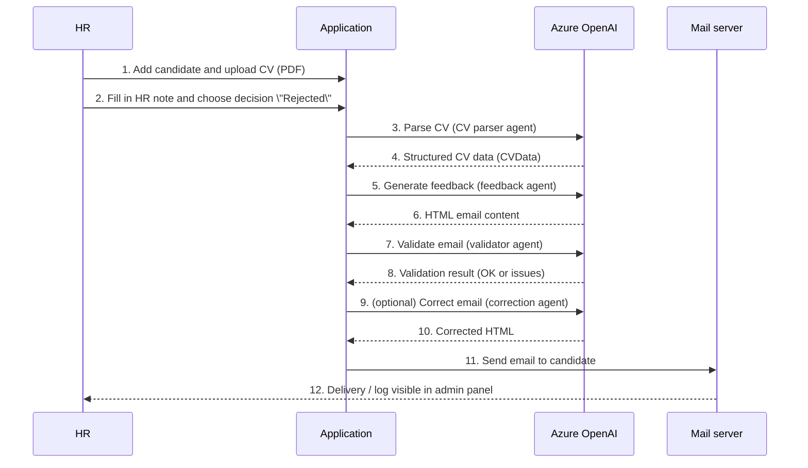
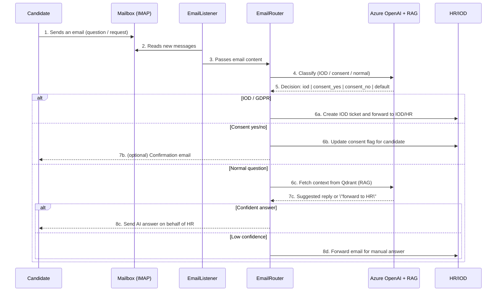

## Recruitment AI – high‑level overview

Recruitment AI is a web application that helps HR teams manage candidates,
analyze CVs, generate personalised feedback emails, and handle incoming
email inquiries using company knowledge (RAG).

### Who is this for

- **HR team** – people running recruitment processes, sending feedback,
  answering candidate questions.
- **Managers / business owners** – want a clear view of the pipeline
  (candidates, stages, sent emails, IOD / GDPR tickets).
- **Candidates** – receive feedback emails and answers to their questions.

### Main features

- **Candidate management** – add and edit candidates, assign them to positions,
  track recruitment stage.
- **CV upload and parsing** – upload PDF files and automatically extract
  key information (experience, education, skills).
- **AI‑generated feedback on rejection** – create constructive, personalised
  feedback emails based on the CV, HR notes and job description.
- **Email sending** – send feedback via SMTP (Zoho, Gmail, others), including
  consent information and privacy‑policy links.
- **Inbox monitoring (optional)** – read emails via IMAP, classify them with AI
  (IOD/GDPR, consent yes/no, normal conversation), create tickets and/or send
  automatic replies.
- **RAG (answers from company documents)** – use a Qdrant vector database to
  answer candidate questions based on internal documents (policies, GDPR/RODO,
  recruitment rules, info about the company).
- **Admin panel & metrics** – see candidates, sent emails, HR notes, tickets,
  and basic statistics/metrics.

> **RAG in simple words:** instead of only using the “raw” AI model, the system
> can search company documents and feed them into the model as context
> (for example GDPR policies or recruitment procedures).

---

## Flow 1: from CV to feedback email

Scenario: HR rejects a candidate and wants to send a clear, consistent
feedback email.

In practice, HR sees in the UI:
a list of candidates, their stage, a “Process”/“Reject with feedback”
action and the history of notes and sent emails.

---

## Flow 2: from candidate email to reply or escalation

Scenario: a candidate replies to an email or sends a new question related
to recruitment, personal data, or offer details.

From the HR perspective:

- the system can automatically handle repetitive, simple questions (FAQ),
- all sensitive topics (GDPR, individual decisions, complaints)
  are still routed to a human (IOD/HR),
- AI decisions can be audited (metrics, admin panel).
