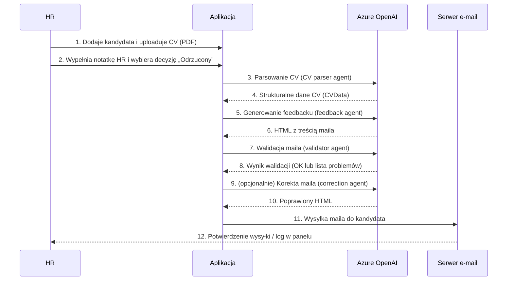
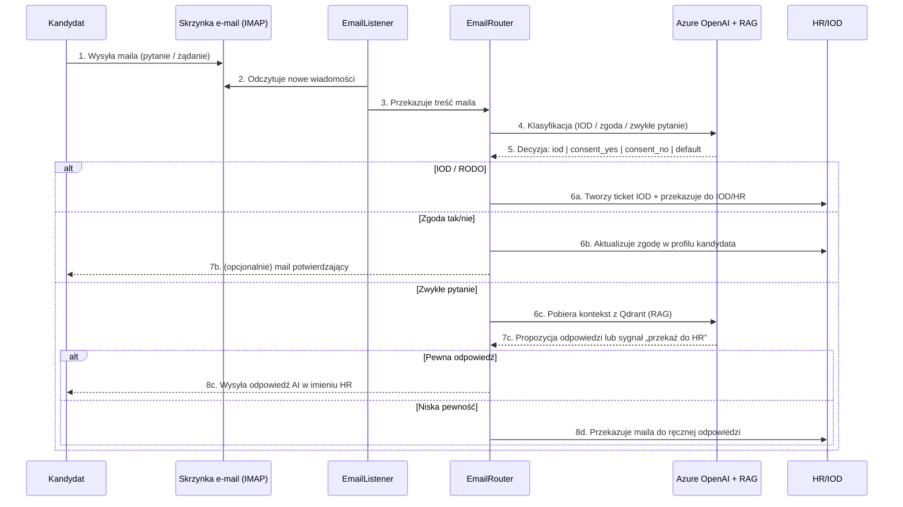

## Przegląd systemu Recruitment AI

Recruitment AI to aplikacja webowa, która pomaga działowi HR:
zarządzać kandydatami, analizować CV, generować spersonalizowane maile
z informacją zwrotną oraz obsługiwać przychodzące zapytania mailowe
z wykorzystaniem wiedzy firmy (RAG).

### Dla kogo jest ten system

- **Dział HR** – osoby prowadzące rekrutacje, wysyłające feedback,
  odpowiadające na pytania kandydatów.
- **Managerowie / business ownerzy** – chcą mieć podgląd procesu
  (kandydaci, etapy, wysłane maile, zgłoszenia IOD).
- **Kandydaci** – odbiorcy maili z informacją zwrotną i odpowiedzi
  na zapytania.

### Główne funkcje

- **Zarządzanie kandydatami** – dodawanie i edycja kandydatów,
  przypisywanie do stanowisk, śledzenie etapu rekrutacji.
- **Przesyłanie i parsowanie CV** – upload plików PDF, automatyczne
  wyciąganie najważniejszych informacji (doświadczenie, edukacja, umiejętności).
- **AI‑generowany feedback przy odrzuceniu** – tworzenie
  konstruktywnych, spersonalizowanych maili z informacją zwrotną
  na podstawie CV, notatki HR i opisu stanowiska.
- **Wysyłka maili** – wysyłanie maili z feedbackiem przez SMTP
  (Zoho, Gmail, inne), z uwzględnieniem zgody na inne rekrutacje
  i linku do polityki prywatności.
- **Monitorowanie skrzynki (opcjonalne)** – pobieranie maili przez IMAP,
  klasyfikacja z użyciem AI (IOD/RODO, zgoda tak/nie, zwykła korespondencja),
  tworzenie ticketów i/lub automatyczne odpowiedzi.
- **RAG (odpowiedzi z dokumentów firmy)** – wykorzystanie wektorowej
  bazy Qdrant do udzielania odpowiedzi na pytania kandydatów na podstawie
  dokumentów (polityki, RODO, informacje o firmie).
- **Panel administracyjny i metryki** – wgląd w kandydatów, wysłane maile,
  notatki HR, ticket’y oraz podstawowe statystyki i metryki.

> **RAG w prostych słowach:** zamiast tylko „czystego” modelu AI,
> system potrafi przeszukać dokumenty firmy i użyć ich jako kontekstu
> do odpowiedzi (np. polityki RODO, procedury rekrutacyjne).

---

## Przepływ 1: od CV do maila z feedbackiem

Scenariusz: HR odrzuca kandydata i chce wysłać mu sensowną, spójną
informację zwrotną.

W praktyce HR widzi w panelu:
listę kandydatów, etap rekrutacji, przycisk „Process”/„Reject with feedback”
oraz historię wysłanych maili i notatek.

---

## Przepływ 2: od maila kandydata do odpowiedzi lub przekazania do HR/IOD

Scenariusz: kandydat odpisuje na maila lub sam wysyła zapytanie
związane z rekrutacją, danymi osobowymi lub warunkami oferty.

Z perspektywy HR:
- system może zdjąć z zespołu powtarzalne, prostsze pytania (FAQ),
- wszystkie wrażliwe tematy (RODO, indywidualne decyzje, skargi)
  trafiają do człowieka (IOD/HR),
- decyzje AI są śledzone (metryki, panel admina).
